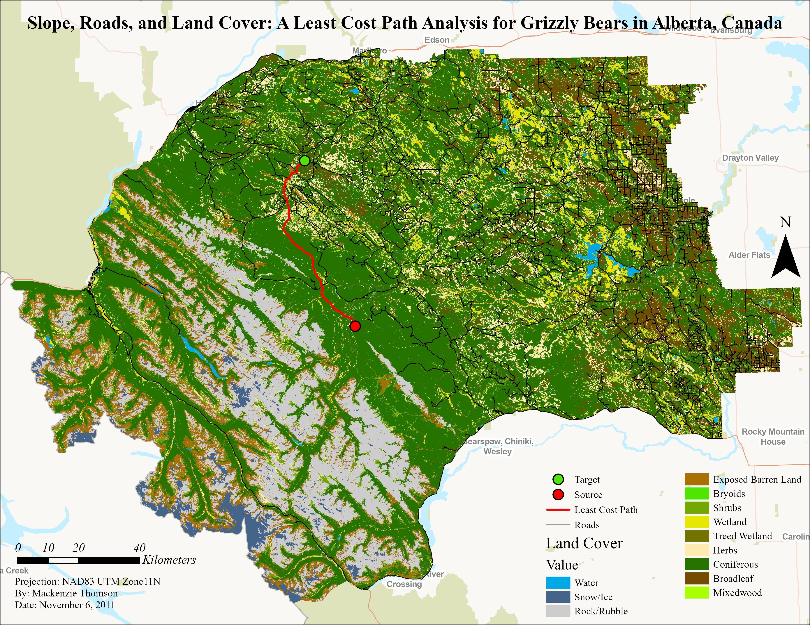

#### Click any map to view full size!

:::::: columns
::: {.column width="55%"}
{width="100%" style="border: 1px solid #eeeeee;" lightbox="true"}
:::

::: {.column width="5%"}
:::

::: {.column width="40%"}
### Fire Related Variable Prediction in a Post-Burn Scenario Using Machine Learning

This map displays the prediction of crown closure and fuel type using the random forest algorithm. The analysis included experimenting with different predictor variables, sampling types (random, stratified, fixed point), and algorithm parameters. An evaluation of model performance was done to determine the best model and produce the resulting surfaces.
:::
::::::

 

:::::: columns
::: {.column width="55%"}
{width="100%" style="border: 1px solid #eeeeee;" lightbox="true"}
:::

::: {.column width="5%"}
:::

::: {.column width="40%"}
### Terrain and Riparian Management Area Analysis

This map visualizes the Nahmint watershed and riparian management areas. This analysis involved mapping the stream network using a DEM and extracting stream characteristics (order, gradient, fish bearing potential) to quantify appropriate riparian reserve and management zones buffers.
:::
::::::

 

:::::: columns
::: {.column width="55%"}
{width="100%" style="border: 1px solid #eeeeee;" lightbox="true"}
:::

::: {.column width="5%"}
:::

::: {.column width="40%"}
### Salmon Stream Network Analysis

This hydrology based analysis applied network topology to evaluate a capability model of salmon habitat along stream segments using linear referencing and barriers. Accessible and inaccessible salmon habitat was then visualized and quantified.
:::
::::::

 

:::::: columns
::: {.column width="55%"}
{width="100%" style="border: 1px solid #eeeeee;" lightbox="true"}
:::

::: {.column width="5%"}
:::

::: {.column width="40%"}
### Spatial Interpolation and Visualization of LiDAR Data

This visual provides a side-by-side comparison of different spatial interpolation algorithms. Zonal statistics present differences in mean and standard deviation between elevation and slope rasters produced with Spline, Nearest Neighbour, and Kriging across three different terrain zones.
:::
::::::

 

:::::: columns
::: {.column width="55%"}
{width="100%" style="border: 1px solid #eeeeee;" lightbox="true"}
:::

::: {.column width="5%"}
:::

::: {.column width="40%"}
### Manual Digitization Accuracy Assessment

This map presents an accuracy assessment and visual comparison of manually digitized building footprints to reference data. Kart was utilized for spatial version control.
:::
::::::

 

:::::: columns
::: {.column width="55%"}
{width="100%" style="border: 1px solid #eeeeee;" lightbox="true"}
:::

::: {.column width="5%"}
:::

::: {.column width="40%"}
### Least Cost Path Analysis

This analysis determines the most efficient routes for Grizzly Bears across a complex landscape, accounting for 'costs' such as steep terrain, land cover, and road crossings.
:::
::::::

 

:::::: columns
::: {.column width="55%"}
{width="100%" style="border: 1px solid #eeeeee;" lightbox="true"}
:::

::: {.column width="5%"}
:::

::: {.column width="40%"}
### Cartographic Modelling of Old Growth Forest Inventories

A spatial assessment of old-growth forest patches. This map compares the percent of old growth forest, derived from VRI, to provincial targets. It highlights conservation priorities based on forest age and fragmentation metrics.
:::
::::::
