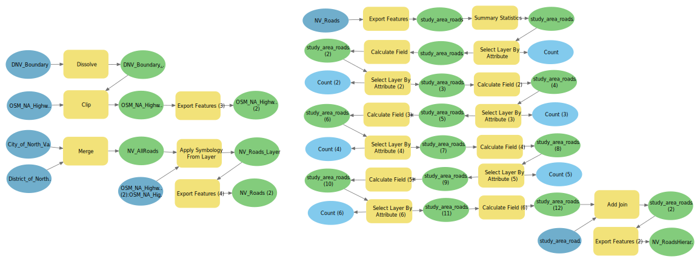

This project demonstrates an integrated GIS workflow designed to support Municipal Transportation Asset Management reporting for the City and District of North Vancouver. By combining the visual logic of ArcGIS Pro ModelBuilder with Python (ArcPy) scripting, this analysis automates the classification and spatial quantification of road networks.

The primary objective was to transform raw OpenStreetMap (OSM) data into a structured hierarchy, enabling automated variable-distance buffering and summaries of specific road types. This hybrid approach provides a scalable framework for calculating essential infrastructure metrics, such as total segment lengths and buffer areas for primary transit corridors.

## Data

-   City and District of North Vancouver Administrative Boundary

-   City and District of North Vancouver Road Network

-   OSM Highways for North America

## Workflow

**Hierarchical Classification of Road Network:** Open Street Map Highways for North America symbology was applied to North Vancouver's road network, allowing hierarchical classification of roads using a hierarchical code for each OSM 'Highway' category:

| OSM 'Highway' Category | Hierarchy Code |
|----|----|
| Motoways | 5 |
| Primary and secondary links | 4 |
| Residential and tertiary links | 3 |
| Service roads and living streets | 2 |
| Corridors, cycleways, foot/pedestrian paths, tracks, and constructions | 1 |
| Other | 0 |

**ModelBuilder Visual:**

## {width="779"}

**Attribute Driven Variable Buffering:** Python scripting in ArcGIS Pro was then used to create a binary road classification based on road hierarchy, then converted to a variable distance buffer.

``` python
arcpy.env.overwriteOutput = True
arcpy.env.workspace = r"...\TransportationRoutesAnalysis.gdb"

fc = "NV_RoadsHierarchy"
out_fc = os.path.join(arcpy.env.workspace, "study_area_roads_hierarchy_bufferByRd")

#Field Names
rd_field = "RD_CODE"
buffer_field = "BUFFER_DISTANCE"

#Add RD_CODE field
existing = [f.name.upper() for f in arcpy.ListFields(fc)]
if rd_field not in existing:
    arcpy.management.AddField(fc, rd_field, "LONG")

#Calculate RD_CODE from hierarchy code
rd_expression = "1 if !Hierarchy! >= 4 else 0"
arcpy.management.CalculateField(fc, rd_field, rd_expression, "PYTHON3")

#Add BUFFER_DISTANCE field
if buffer_field not in existing:
    arcpy.management.AddField(fc, buffer_field, "DOUBLE")

#Calculate BUFFER_DISTANCE from RD_CODE
buffer_expression = "!RD_CODE! * 100"

arcpy.management.CalculateField(fc, buffer_field, buffer_expression, "PYTHON3")

#Run variable distance buffer
arcpy.analysis.Buffer(
    in_features=fc,
    out_feature_class=out_fc,
    buffer_distance_or_field=buffer_field,
    line_side="FULL",
    line_end_type="ROUND",
    dissolve_option="NONE",
    method="PLANAR")
```

**Filter and summarize road length:** A SearchCursor was then applied to isolate primary routes and calculate the total combined segment length and buffer area.

``` python
gdb = r"...\TransportationRoutesAnalysis.gdb"
fc = os.path.join(gdb, 'NV_RoadsHierarchy')
arcpy.env.workspace = gdb

#Filter and sum road lengths using a searchcursor
where_clause = "Hierarchy > 4"
total_length_m = 0.0

with arcpy.da.SearchCursor(fc, ["SHAPE@LENGTH"], where_clause) as cursor:
    for (length_val,) in cursor:
        if length_val is not None:
            total_length_m += length_val

#Print output 
print(f"Total length (Hierarchy > 4): {total_length_m:,.2f} m "
      f"({total_length_m/1000:,.2f} km)")

[1] Total length (Hierarchy > 4): 49,751.07 m (49.75 km)

#Filter and calculate area using a searchcursor
buffer_field = "BUFFER_DISTANCE"
total_buffer_area_m2 = 0.0

with arcpy.da.SearchCursor(fc, ["SHAPE@", buffer_field], where_clause) as cursor:
    for geom, buf_dist in cursor:
        if geom is not None and buf_dist:
            buf_geom = geom.buffer(buf_dist)  
            total_buffer_area_m2 += buf_geom.area

print(f"Total buffer area (Hierarchy > 4/RD_CODE=1): {total_buffer_area_m2:,.2f} m² "
      f"({total_buffer_area_m2/1e6:,.3f} km²)")

[1] Total buffer area (Hierarchy > 4 / RD_CODE=1): 16,211,603.01 m² (16.212 km²)
```

**Visual Results:**

```{r, leaflet-map, echo=FALSE, warning = FALSE, message = FALSE}
library(sf)
library(leaflet)
library(dplyr)

#layers
osm_roads <- suppressMessages(st_read("C:/MGEM/BCIT/Labs/GIST8138/Module3_ScriptTools/Data/nv_roads_osm_symbolized.shp", quiet = TRUE))
reclass_roads <- suppressMessages(st_read("C:/MGEM/BCIT/Labs/GIST8138/Module3_ScriptTools/Data/nv_roads_reclassified.shp", quiet = TRUE))
buffers <- suppressMessages(st_read("C:/MGEM/BCIT/Labs/GIST8138/Module3_ScriptTools/Data/major_roads_buffers.shp", quiet = TRUE))

#reproject for leaflet
osm_roads <- st_transform(osm_roads, 4326)
reclass_roads <- st_transform(reclass_roads, 4326)
buffers <- st_transform(buffers, 4326)

# Color palette for hierarchy
pal <- colorFactor(
  palette = c("darkgreen", "orange", "darkred", "lightgreen", "pink", "purple"),
  domain = reclass_roads$hierarchy
)

# Build leaflet map
leaflet() %>%
  addProviderTiles(providers$CartoDB.Positron, group = "Light Grey Basemap") %>%
  addPolylines(data = osm_roads, color = "black", weight = 2, opacity = 0.6, group = "OSM Roads") %>%
  addPolylines(data = reclass_roads, color = ~pal(hierarchy), weight = 3, opacity = 0.8, group = "Reclassified Roads") %>%
  addPolygons(data = buffers, color = "yellow", fillOpacity = 0.3, group = "Buffers") %>%
  addLayersControl(
    overlayGroups = c("OSM Roads", "Reclassified Roads", "Buffers"),
    options = layersControlOptions(collapsed = FALSE)
  ) %>%
  addLegend(pal = pal, 
  values = reclass_roads$hierarchy, 
  title = "Road Hierarchy",
  opacity = 1) %>%
  addScaleBar(position = "bottomleft")
```
