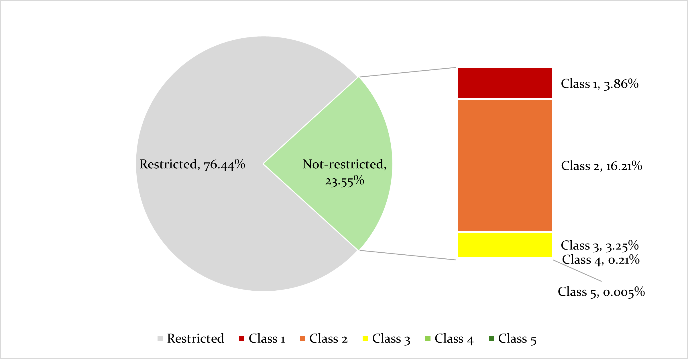
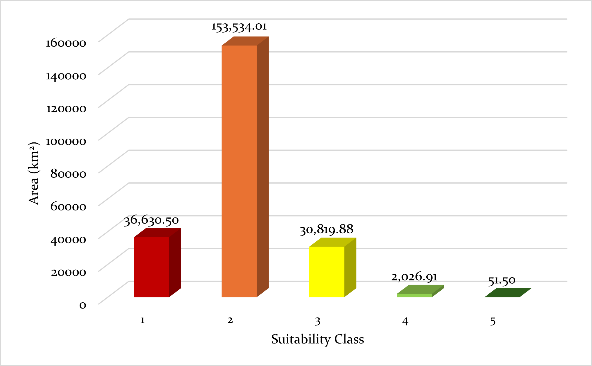

This project utilizes the Analytic Hierarchy Process (AHP), a Multi-Criteria Decision Analysis (MCDA) framework, to evaluate potential locations for utility-scale (1MW+) solar development across British Columbia. By integrating environmental, technical, and economic variables, the study identifies optimal development zones while strictly adhering to provincial land-use regulations.

## **The Suitability Framework**

The model balances development potential against environmental constraints through a weighted overlay of key criteria:

| Technical & Economic Drivers | Environmental & Regulatory Constraints |
|------------------------------------|------------------------------------|
| Solar Power: Global Horizontal Irradiance (GHI) | Terrain Constraints: Water Bodies, Wetlands, Permanent Snow and Ice |
| Terrain: Slope and aspect optimization | Regulatory: Agricultural Land Reserve (ALR), Protected and Conserved Areas |
| Infrastructure: Proximity to Substations and Major Roads | Land Cover: Dense Forests (Canopy\>40%), Artificial/Built Environments |
| Demand: Proximity to Major Cities | Buffers: Roads (100m) and urban (1000m) setback |

## **Technical Workflow & Implementation**

To translate these diverse datasets into a unified suitability model, I developed a custom spatial workflow in R involving these key steps:

-   Data Harmonization: Standardized heterogeneous datasets into a common 30m grid aligned with the BC Environmental Albers (EPSG:3005) projection.

-   Constraint Modeling: Programmatically generated unified exclusion mask for protected areas, high-canopy forests, and unsuitable terrain, applying precise Euclidean distance buffers for urban and infrastructure setbacks.

-   Criteria Weight Derivation: Employed the Analytic Hierarchy Process to derive objective influence weights using relative importance ratings from industry experts. By constructing a pairwise comparison matrix and calculating the principal eigenvector, I ensured a Consistency Ratio (CR) \< 0.1, mathematically validating the relative importance of solar potential versus technical constraints.

-   Weighted Overlay Analysis: Integrated the AHP-derived weights into a multi-criteria scoring system. This reclassified model input criteria into a common scale, allowing for the quantitative comparison of technical potential against environmental sensitivity.

**Calculated Suitability Weights**

| Criterion | Derived Weight | Primary Justification |
|-----------------------|---------------|----------------------------------|
| Global Horizontal Irradiance (GHI) | 26.8 | The fundamental driver of project energy generation potential |
| Proximity to Energy Infrastructure | 25.9 | Influence on grid optimization and installation costs |
| Proximity to Major Roads | 24.8 | Increases site accessibility and facilitates construction |
| Aspect | 10.1 | Effects solar radiation incidence |
| Proximity to Major Cities | 9.0 | Benefits of reduced distribution costs are moderated by social preference for developments away from population centers |
| Slope | 3.3 | Simplified installation process on gentle terrain |

## Interactive Suitability Map

Suitability is ranked on a 1-5 scale, with 1 being least suitable and 5 being very suitable. The mask layer, ranked as 0, represents unsuitable land where solar farm installations are not feasible or permitted.

```{r leaflet, echo = FALSE, warning = FALSE, message = FALSE}

library(terra)
library(leaflet)
library(leaflet.extras2)

#Load web ready data (aggregated x16 and projected to 4326)
suitability_raw_web <- rast("C:/Users/kenzthom.stu/OneDrive - UBC/GIT/E-Portfolio/myData/suitability_raw_web.tif")
suitability_final_web <- rast("C:/Users/kenzthom.stu/OneDrive - UBC/GIT/E-Portfolio/myData/suitability_final_web.tif")

# Define color palettes
#for raw suitability
rng_raw <- terra::minmax(suitability_raw_web)
raw_pal <- colorNumeric(
  palette = "RdYlGn",
  domain = rng_raw, 
  na.color = "transparent")

#for classified suitability
class_levels <- 0:5
class_labels <- c("Mask",
                  "Least Suitable",
                  "Less Suitable",
                  "Moderately Suitable",
                  "Suitable",
                  "Very Suitable")

final_pal <- colorFactor(
  palette = c("grey", "red", "orange", "yellow", "green", "darkgreen"),
  domain = class_levels,
  na.color = "transparent"
)

#Build leaflet map
#set up the two map panes
leaflet() %>%
  addMapPane("right", zIndex = 1) %>%
  addMapPane("left",  zIndex = 2) %>%
  
#add the ESRI basemap to both map panes
addProviderTiles("Esri.WorldImagery", group = "base", layerId = "baseid1", options = pathOptions(pane = "right")) %>%
addProviderTiles("Esri.WorldImagery", group = "base", layerId = "baseid2", options = pathOptions(pane = "left")) %>%
  
  # Suitability
  addRasterImage(
    suitability_raw_web,
    colors = raw_pal,
    group = "Raw Suitability", #provide name for layer
    maxBytes = 10 * 1024 * 1024, #allowable size of raster
    options = leafletOptions(pane = "left")) %>%
  
  # Mask
  addRasterImage(
    suitability_final_web,
    colors = final_pal,
    group = "Classified Suitability",
    maxBytes = 10 * 1024 * 1024,
    options = leafletOptions(pane = "right")) %>%
  
  # Legend
  addLegend(
  position = "bottomright",
  pal = final_pal,
  values = class_levels,
  labels = class_labels,
  title = "Suitability Class",
  opacity = 1) %>%
  
#allow for layers to be toggles on/off by adding them to the layers control
addLayersControl(overlayGroups = c("Raw Suitability", "Classified Suitability")) %>%
  
#add slider control
addSidebyside(layerId = "sidecontrols",
                rightId = "baseid1",
                leftId  = "baseid2",
                options = list(padding = 0)) %>%
  
  addScaleBar(position = "bottomleft")

```

## Aspatial Results

:::::: columns
::: {.column width="48%"}


76.5% (723,947.99 km²) of BC is restricted from solar farm development. Non-restricted land\
accounts for the remaining 23.55% (223,027.33 km²) of the province. Within this area, class 1\
comprises 3.86% of the provincial land base, class 2 represents the largest share at 16.21%, and\
class 3 accounts for 3.25%. The highest suitability classes occupy only a very small portion of the\
province, with class 4 covering 0.21% and class 5 covering just 0.005%.
:::

::: {.column width="4%"}
:::

::: {.column width="48%"}


Areal extent (km^2^) of each suitability class within the non-restricted land base. Class 2 occupies the largest area at 153,533.01 km^2^, while class 5 occupies the smallest area at 51.50km^2^. Class 1, 3, and 4 occupy varying areas and comprise the remaining 69,477.23 km^2^ of land available for solar farm installations.
:::
::::::
